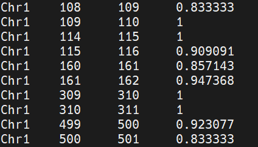
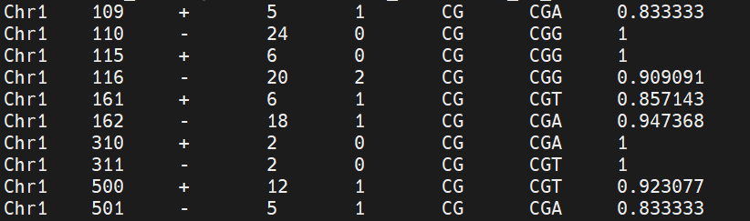
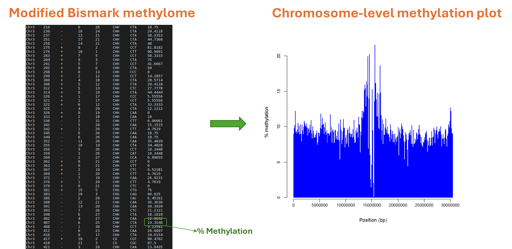
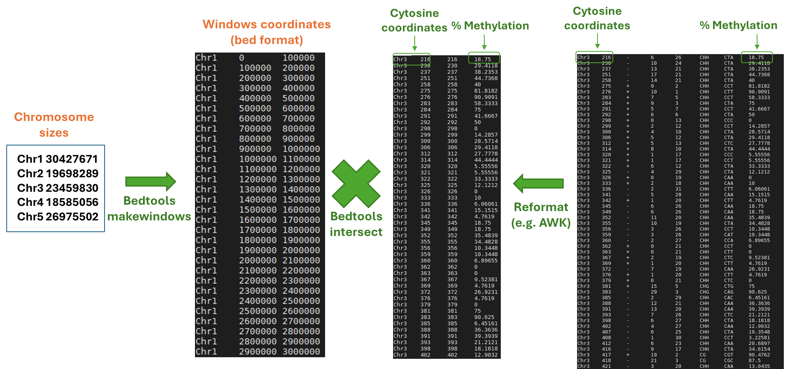

# 1. Filtering of the dataset 
Before reading the file in `R` we need to filter the file in order to remove positions without coverage and by selecting the methylation contexts (`CG`) of interest. We will use again `awk` for this purpose.

The file has been already used in the previous tutorial. (add link)

The file is located at the following path:

`/data2/biotecnologie_molecolari_magris/epigenomics/meth_distribution/arabidopsis_wgbs.CX_report.txt`

It should be already available in your directory:
`/data2/student_space/st24_16_folder/epigenomics/methylation_distribution/`


```bash
# move the working directori
cd /data2/student_space/st24_16_folder/epigenomics/

# create a new directory for this tutorial
mkdir -p genome_wide_meth/

# filter the input file in order to keep only the methylation context of interest (CG) and to keep sites located on Chr1 with a coverage greater than 0
awk '{if($1=="Chr1" && ($4+$5)>0 && $6=="CG") print $0}' methylation_distribution/arabidopsis_wgbs.CX_report.txt > genome_wide_meth/arabidopsis_chr1_CG.txt
```


# 2. Upload the data in `R`
We can load the R environment and upload the filtered file in `R` using the following commands:

```bash
R 
```

```r
# load the data
CG <- read.table("genome_wide_meth/arabidopsis_chr1_CG.txt",header=FALSE,sep="\t",stringsAsFactors=FALSE)

# change the columns names (because we don't have a header)
names(CG) <- c("chr","pos","strand","c","t","context","genome_context")

# calculate the coverage per site
CG$coverage <- CG$c + CG$t

# calculate the methylation level per site
CG$methylation_level <- round(100*(CG$c / (CG$c + CG$t)),0)

```


# 3. Creating genomic windows of a fixed size
The chromosome will be divided in non-overlapping windows of a fixed size (e.g. 100,000 bp). The size of the windows is totally arbitrary. The methylation values will be averaged in each window. The size of 100 Kb is sufficient to represent graphically the methylation distribution along the chromosome.

Next we need to assing each C position to a genomic window (for example the C in position 1,145 will be assigned to the window 1-10,000, while the C in position 15,300 will be assigned to the window 10,001-20,000).

<!--We will use the `cut` function in `R` to assign each C position to a genomic window-->
We can perform this operation in a vectorized way using the column with the genomic coordinates (from the CG data.frame) and a new vector of defined intervals (will become a new column in the CG data.frame).

We need to calculate the start and end of each window. We can do this by dividing the chromosome length by the window size and rounding up to the nearest integer (to avoid windows that are not fully contained in the chromosome). 

We need to know the starting and ending coordinates and the length of the chromosome in order to divide the chromosome in windows of a specified size. We can do this by using the `cut` function in `R` with the `breaks` argument. The `breaks` argument is used to specify the points at which to split the data. `breaks` define the last value of each window. 

For example the breaks of a fragment of 100 bp, (from 1 to 100bp), divided in windows of 10 bp, will be:

```r
my_breaks=c(0,10,20,30,40,50,60,70,80,90,100)
```
{: .note }
(starting from 0)

The same vector can be obtained in an automatic (simplified) way using the following code:

```r
my_breaks=seq(0,100,by=10)
```

The vector with intervals of the windows assigned to each position, of length from 1 to 100 can be obtained using the `cut` function:

```r
# Define the genomic positions
all_genomic_positions=1:100

# Use the cut function
cut(all_genomic_positions,breaks=my_breaks)
```


<!--
{: .success-title }
> STDOUT message
>
>  [1] (0,10]   (0,10]   (0,10]   (0,10]   (0,10]   (0,10]   (0,10]   (0,10]   (0,10]   (0,10]   (10,20]  (10,20]  (10,20]
> 
> [14] (10,20]  (10,20]  (10,20]  (10,20]  (10,20]  (10,20]  (10,20]  (20,30]  (20,30]  (20,30]  (20,30]  (20,30]  (20,30] 
> 
> [27] (20,30]  (20,30]  (20,30]  (20,30]  (30,40]  (30,40]  (30,40]  (30,40]  (30,40]  (30,40]  (30,40]  (30,40]  (30,40] 
> 
> [40] (30,40]  (40,50]  (40,50]  (40,50]  (40,50]  (40,50]  (40,50]  (40,50]  (40,50]  (40,50]  (40,50]  (50,60]  (50,60] 
> 
> [53] (50,60]  (50,60]  (50,60]  (50,60]  (50,60]  (50,60]  (50,60]  (50,60]  (60,70]  (60,70]  (60,70]  (60,70]  (60,70] 
> 
> [66] (60,70]  (60,70]  (60,70]  (60,70]  (60,70]  (70,80]  (70,80]  (70,80]  (70,80]  (70,80]  (70,80]  (70,80]  (70,80] 
> 
> [79] (70,80]  (70,80]  (80,90]  (80,90]  (80,90]  (80,90]  (80,90]  (80,90]  (80,90]  (80,90]  (80,90]  (80,90]  (90,100]
> 
> [92] (90,100] (90,100] (90,100] (90,100] (90,100] (90,100] (90,100] (90,100] (90,100]
> 
> 10 Levels: (0,10] (10,20] (20,30] (30,40] (40,50] (50,60] (60,70] (70,80] (80,90] (90,100]
-->

The output of the command shows the interval that are assigned to each single coordinate. We can replace the intervals labels (for example (0,10] ) with the corresponding window number (for example 1) or for example the genomic coordinates of each window (1, 100,000 ...) using the `label` argument of the `cut` function. *Labels* is a vector which need to have the same size as the vector *breaks* less than one unit and contains the labels to be assigned to each interval. Remember that breaks as 0 at the beginning 

```r
# Define the genomic positions
all_genomic_positions <- 1:100
# Define the breaks
my_breaks <- c(0, 10, 20, 30, 40, 50, 60, 70, 80, 90, 100)
# Define the labels
my_labels <- c(10,20,30,40,50,60,70,80,90,100)

# The labels can be obtained directly 
# from the genomic coordinate of the windows
my_labels <- my_breaks[-1]

# compare the length of the vectors with length()
length(my_breaks)
length(my_labels)

# add the label to the new vector
cut (all_genomic_positions, breaks= my_breaks, labels=my_labels)
```

The output of the command shows the interval that are assigned to each single coordinate. 


Now we want to apply the same approach to the data.frame with the CG methylation data. We need to define the breaks and the labels. The breaks are the same as before, but the labels are the genomic coordinates of the windows.


```r
# Get the maximum coordinate of the data frame
max(CG$pos)

# since the coordinate isn't so nice, 
# we can round it to the nearest multiple of 10
max_pos <- 10000*ceiling(max(CG$pos)/10000)

# Define the breaks
my_breaks <- seq(0,max_pos,by=10000)

# Define the labels
my_labels <- my_breaks[-1]

# Apply the cut function to the data frame by adding a new column
CG$window <- cut(CG$pos, breaks=my_breaks, labels=my_labels)

# Check the modified data.frame
head(CG)
```
The new dataframe will look like:


```r
# Check the last part modified data.frame
tail(CG)
```


For each site we have now the assigned windows coordinate. 
We can now create a data.frame with the average methylation for each window, using basic `R` functions.

For example:
```r
# Use the aggregate funcion, to get the average per window
aggregate(methylation_level~window,data=CG_windows, FUN = mean)
```

FUN can be also used with length, in order to get the number of Cs per window. Thus we can combine both, in order to obtain simultaneously the average and the number of Cs per window.
```r
meth_out <- aggregate(methylation_level~window,data=CG, FUN = function(x) c(mean=mean(x),length=length(x)))
```

We should obtain a new data.frame with the following format 
```
  window methylation_level.mean methylation_level.length
1  10000             14.8915254              295.0000000
2  20000             11.2288732              284.0000000
3  30000             43.3624454              458.0000000
4  40000             20.9012987              385.0000000
5  50000              0.9794118              340.0000000
6  60000              7.8664441              599.0000000
```

The 2 columns methylation_level.mean and methylation_level.length are seen as an unique column, because we used aggregate(). 



If we want to have them as separate columns, we can use the do.call function

```r
meth_out <- do.call(data.frame,meth_out)
```
This will transform the output to a 3 columns table.


Now we are ready to produce the graph. We will need ggplot2 package.


```r
library(ggplot2)
ggplot(meth_out, aes(x=window,y=methylation_level.mean)) + 
geom_bar(stat="identity", col="blue")
```



We can improve the quality of the plot by means of the options available in ggplot.

This sections define the input data and the columns to be used
`ggplot(meth_out, aes(x=window,y=methylation_level.mean))`

Here we define the type of graph, a bar graph and the color of the bars
`+ geom_bar(stat="identity", col="blue")`

We can modify the *x labels*
`+ scale_x_discrete(breaks=function(x)x[seq(1,length(x),by=100)])`

We can rotate the *x labels*
`+ theme(axis.text.x=element_text(angle=45,hjust=1))`

We can rename the axis labels
`+labs(x="10 Kb windows", y="methylation (%)")`

We can set the plot title
`+ggtitle("CG methylation distribution in chr1")`

The full command will be:
```r
ggplot(meth_out, aes(x=window,y=methylation_level.mean)) +
geom_bar(stat="identity", col="blue") + 
scale_x_discrete(breaks=function(x)x[seq(1,length(x),by=100)], labels=function(x) round(as.numeric(x)/1000000,0)) + 
theme(axis.text.x=element_text(angle=45,hjust=1)) +
labs(x="10 Kb windows", y="methylation (%)") +
ggtitle("CG methylation distribution in chr1")
```

And we will get



The plot is now shown in an interactive windows on the terminal. In order to save the plot to a pdf file, we can use the following command.
```r
# Open the device
pdf("genome_wide_meth/CG_methylation_chr1.pdf",paper="A4")

# Draw the plot
ggplot(meth_out, aes(x=window,y=methylation_level.mean)) +
geom_bar(stat="identity", col="blue") + 
scale_x_discrete(breaks=function(x)x[seq(1,length(x),by=100)], labels=function(x) round(as.numeric(x)/1000000,0)) + 
theme(axis.text.x=element_text(angle=45,hjust=1)) +
labs(x="10 Kb windows", y="methylation (%)") +
ggtitle("CG methylation distribution in chr1")

# Close the device
dev.off()
```


For example , if we want to divide the chromosome in windows of 100,000 bp, we can use the following code:

We can replace the intervals (0,10] with increasing numbers that identify the windows (1,2,3,4,5..) or with numbers that represent the end coordinates of each windows (100000,200000,300000..). For example:

This can be obtained using labels of the cut function. labels is a vector with the same size of the breaks vectore (less one unit, because it has a number at the beginning).

```r
# define the breaks
my_breaks=c(0,10,20,30,40,50,60,70,80,90,100)

# define the labels 
my_labels=c(1,2,3,4,5,67,8,9,10)

# or
my_labels=c(10,20,30,40,50,60,70,80,90,100)
```

The vector my_labels and my_breaks can also be created in an automatic way (little bit more tricky):

```r
# my_labels
my_labels = c(1,2,3,4,5,6,7,8,9,10) 

#can be obtained 

my_lables=1:(length(seq(0,100,by=10))-1)
```

```r
my_breaks = seq(0,100,by=10) 

#can be obtained 

my_lables=my_breaks[-1]
```

So what we obtain will be:

```r
all_genomic_positions=1:100

my_breaks = seq(0,100,by=10)

my_labels = my_breaks[-1]

cut(all_genomic_positions,breaks=my_breaks,labels=my_labels)
```

{: .success-title }
> STDOUT message
>

If we want to apply the same to the CG data.frame

```r
maxpos=1000*ceiling(max(CG$pos)/10000)
my_breaks=seq(0,maxpos,by=1000)
my_labels=my_breaks[-1]
CG$window=cut(CG$pos,breaks=my_breaks,labels=my_labels)
```

--- 
