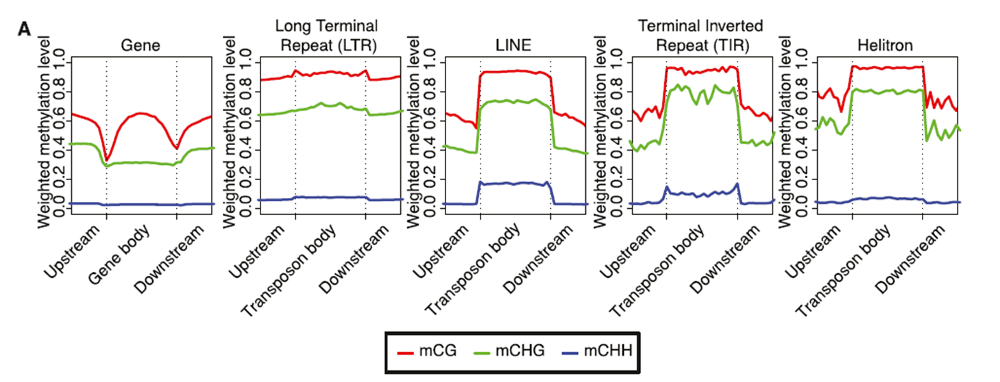
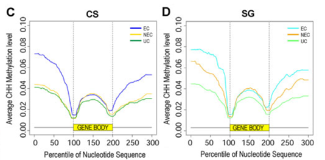

INCOMPLETE
{: .label .label-red }

{: .important-title }
> Aim
>
> Obtain a graph with the window distribution of methylation values across a chromosome in three contexts `CG`, `CHG` and `CHH`, using `R`.

<br>
<details open markdown="block">
  <summary>
    <strong>Table of contents</strong>
  </summary>
  {: .text-delta }
- TOC
{:toc}
</details>
<br>


{: .important-title }
> Aim
>
> The goal is to generate graphs representing average methylation profiles in structurally homogeneous genomic regions, such as across all genes or all members of a specific transposon type.


For example from a meta-analysis in the soybean genome:



*From Schmitz et al., 2013, GenomeResearch*

A repeated meta-analysis on data from different biological conditions can immediately highlight significant and widespread changes in DNA methylation profiles, as seen in the following example comparing different developmental stages of grapevine calli at the gene level and adjacent regions:



*From Dal Santo, De Paoli et al., 2021, Plant Physiology*

---

## Rationale of the Procedure

Each gene is ideally divided into 100 equal-length regions (called percentiles, intervals, or bins), numbered from 1 to 100. All cytosines present in percentile 1 of each gene are used to compute an average methylation value for percentile 1. This process is repeated for all 99 remaining percentiles.

An extract of the final file will look like this, with a percentile column (from 1 to 100) and a column containing their average methylation values.


{: .note}
> The percentile lengths will be uniform within the same gene but will vary among genes due to their different sizes. However, this method allows standardization across genes of varying lengths.
>
> Another widely used approach in the literature is to analyze only the first portion of genes (choosing an arbitrary but absolute length, e.g., 500 bp) and the last portion in the same manner, without analyzing the internal gene region.


We will use the methylation table obtained from Bismark. The file represent the result of wgbs performed in _Arabidopsis thaliana_ sample.

The file is located at the following path:

`/data2/biotecnologie_molecolari_magris/epigenomics/meth_distribution/arabidopsis_wgbs.CX_report.txt`

The suffix of the file is `.CX_report.txt` as already seen in the previous lessons.
The structure is as follows:


<br>

**Figure 1:** First rows of the *arabidopsis_wgbs.CX_report.txt* file.

The file is tab separated and the columns are in the following order:
1. **chromosome**
2. **coordinate**
3. **strand**
4. **number of reads with methylation for the C**
5. **number of reads without methylation**
6. **C-context**
7. **trinucleotide context**

<!--
## Input Dataset

For this analysis, a methylome table is required, such as the one generated by the Bismark software pipeline.

For this exercise, a methylome table of *Arabidopsis thaliana* is used. The file, at the time this tutorial was written, is located at the following path on the teaching server:

```
/biotecnologie_molecolari_depaoli/bismark_methylome_example/Arabidopsis_wgbs.CX_report.txt
```

The file ends with the suffix `...CX_report.txt` and is structured as follows:

The different columns (accessible in AWK with `$1`, `$2`, `$3`, etc.) indicate, in order:

- Chromosome
- Cytosine position
- DNA strand
- Reads showing methylation at that cytosine
- Reads not showing methylation
- Context type (CG/CHG/CHH)
- Actual sequence context

---

## Filtering and Fractioning the Methylome Table

The initial methylome table must be filtered to remove cytosine positions not covered by any reads (`($4+$5)>0`). It must then be split into three separate files containing only the CG, CHG, and CHH contexts, respectively. For faster computation during the exercise, only chromosome 1 (Chr1) data will be used, although ideally, data from all chromosomes should be included.

This step is common to a previous exercise and can be skipped if the required files are already available.

**Command-line operations (Linux terminal):**

```sh
$ awk '{if ($1=="Chr1" && ($4+$5)>0 && $6=="CG") print $0}' "Arabidopsis_wgbs.CX_report.txt" > Arabidopsis_Chr1_CG.txt
$ awk '{if ($1=="Chr1" && ($4+$5)>0 && $6=="CHG") print $0}' "Arabidopsis_wgbs.CX_report.txt" > Arabidopsis_Chr1_CHG.txt
$ awk '{if ($1=="Chr1" && ($4+$5)>0 && $6=="CHH") print $0}' "Arabidopsis_wgbs.CX_report.txt" > Arabidopsis_Chr1_CHH.txt
```
-->

# 1. Filter the dataset 

The initial methylome table must be filtered to remove cytosine positions not covered by any reads. We will use again `awk` for this purpose. It must then be split into three separate files containing only the `CG`, `CHG`, and `CHH` contexts, respectively. For faster computation during the exercise, only chromosome 1 (Chr1) data will be used, although ideally, data from all chromosomes should be included.

The file has been already used in the previous tutorial. (add link)

The file is located at the following path:

`/data2/biotecnologie_molecolari_magris/epigenomics/meth_distribution/arabidopsis_wgbs.CX_report.txt`

It should be already available in your directory:
`/data2/student_space/st24_16_folder/epigenomics/methylation_distribution/`


```bash
# Move the working directory
cd /data2/student_space/st24_16_folder/epigenomics/

# Create a new directory for this tutorial
mkdir -p meta_analysis/

# Filter the input file in order to keep only the methylation context of interest (CG) and to keep sites located on Chr1 with a coverage greater than 0
awk '{ if ($1=="Chr1" && ($4+$5)>0 && $6=="CG") {meth = $4/($4+$5); print $0"\t"meth}}' \
methylation_distribution/arabidopsis_wgbs.CX_report.txt > meta_analysis/arabidopisis_chr1_CG.txt
```

The same filters can be applied for `CHG` and `CHH` contexts.


# 2. Covert filtered Bismark output to BED Format

Since the meta-analysis can be performed using [`bedtools`](https://bedtools.readthedocs.io/en/latest/), the methylation files need to be converted into BED format.

```sh
awk '{chr=$1; start=$2 - 1; end=$2; meth=$8; print chr"\t"start"\t"end"\t"meth}' meta_analysis/arabidopisis_chr1_CG.txt > meta_analysis/arabidopisis_chr1_CG.bed
```

*Similar commands apply for CHG and CHH contexts*


## Prepare Gene Coordinates File to be used by bedtools (GFF to BED Conversion)

```sh
awk '{chr=$1; start=$4 - 1; end=$5; print chr"\t"start"\t"end"}' "Arabidopsis_gff_for_metaanalysis_students.gff" > genes.bed
```


## Divide genes into percentiles

```sh
bedtools makewindows -b positive_genes.bed -n 100 -i winnum > positive_genes_bins.bed
bedtools makewindows -b negative_genes.bed -n 100 -i winnum -reverse > negative_genes_bins.bed
```

---

## Intersecting Percentile Coordinates with Cytosine Coordinates

```sh
$ bedtools intersect -a genes_bins.bed -b Arabidopsis_Chr1_CG_meth.bed -loj > intersect_CG.txt
```

---

## Calculating Average Methylation per Percentile

```sh
$ bedtools groupby -i intersect_CG_sorted.txt -g 4 -c 8 -o mean > percentile_meth.txt
```

---

## Visualization of Meta-Analysis

Using **R** with **ggplot2**:

```r
library(tidyverse)
percentiles = read.table("percentile_meth.txt", stringsAsFactors=F, header=F)
names(percentiles) = c('percentile', 'meth')
ggplot(percentiles, aes(x=percentile, y=meth)) + geom_point()
```

To save the graph as a PDF:

```r
pdf("meta.pdf", paper="A4")
ggplot(percentiles, aes(x=percentile, y=meth)) + geom_point()
dev.off()
