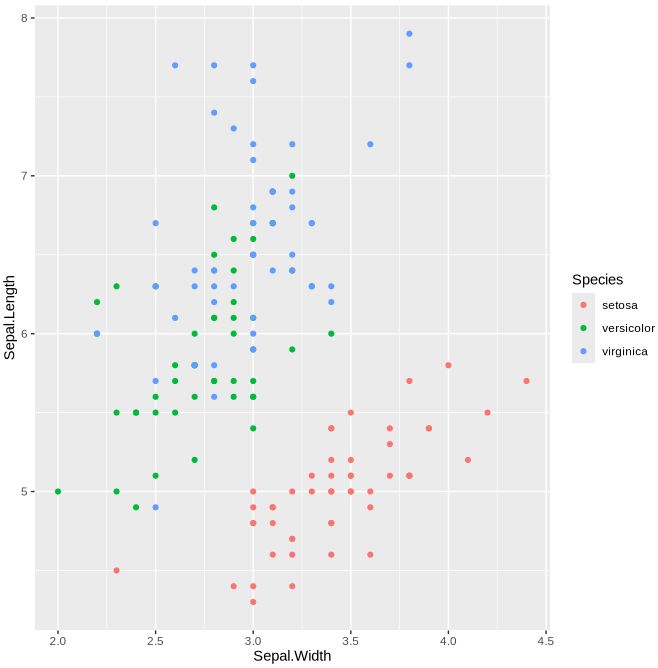

INCOMPLETE
{: .label .label-red }

{: .important-title }
> Aim
>
> Obtain a graph with the window distribution of methylation values across a chromosome in three contexts `CG`, `CHG` and `CHH`, using `bedtools`.

<br>
<details open markdown="block">
  <summary>
    <strong>Table of contents</strong>
  </summary>
  {: .text-delta }
- TOC
{:toc}
</details>
<br>

Multivariate analysis is a statistical approach that focuses on analyzing multiple variables of an experiment simultaneously. This technique is used to identify patterns, relationships and correlations between different variables as to detect the major combinations of factors that drive or influence the behavior of samples that are described by those variables. Relationships between samples that are described by those variables can also be identified using multivariate analysis methods. Thus, with this approach it is possible to sort the individual samples of an experiment (e.g. a number of animal or plants) into groups of samples that behave in a homogeneous way within each group but are differentiated between groups, according to the overall variables (characteristics) that describe those samples.

Among multivariate analysis methods, Principal Component Analysis stands out for popularity and broader use in scientific literature. It comes with different flavors, three of which will be briefly described in this mini-tutorial:

1.	Principal Components Analysis (in strict sense) or PCA
2.	Correspondence analysis or CA
3.	Multiple correspondence analysis or MCA

All these methods elaborate data to produce the so-called principal components, which represent a way to identify, sort and combine all the variables describing a dataset into a new set of fewer composite variables that are capable of dissecting most the of variability in the data.

Typical datasets that are prone to be analyzed by PCA are two-entry tables with individuals indicated in rows and numerical variables indicated in columns, like the following examples (Fig. 1):


°°°°

**Figure 1:** Examples of dataset amenable to PCA analysis

PCA is defined as an orthogonal linear transformation that transforms the data to a new coordinate system such that the greatest variance by some scalar projection of the data comes to lie on the first coordinate (called the first principal component), the second greatest variance on the second coordinate, and so on.

In more simple words, every single variable can be regarded as a coordinate in a multidimensional space. N variables represent a N-dimensions space in which the individual samples are located (Figure 2). Individuals with similar features share similar values in many or most variables and are expected to be located very close to each other in the multidimensional space. 

The PCA algorithm identifies variables that are most important to distinguish the samples, variables that are less influential and variable that are redundant with others. At the end of the process, the effects of distinct variables in representing the overall variability between samples will be algebraically combined in a smaller number of synthetic variables (dimensions or principal components) sorted by descending order, from the one that describes most the of variance present in the dataset to the one describing the least. Individual samples can be imagined as distributed in a new space with fewer dimensions than the original number of variables (Fig. 3). 

Each new principal component can be a combination of few or more original variables that are highly correlated to each other. Typically, the first two or three principal components (being the most informative synthetic variables generated by the algorithm) provide the x-y (or x-y-z) coordinates of a 2D (or 3D) space where individual samples can be plotted to identify clusters of samples with similar features. 

**Figure 2:** Dataset variables regarded as coordinates of individual samples into a multidimensional space.

**Figure 3:** Principal components regarded as new coordinates of individual samples into a simplified multidimensional space. The first two or three dimensions can suffice in representing a 2D or 3D (not shown) space where samples can be located to identify their proximity. 


## Differences between PCA, CA and MCA

**_Input dataset_**

PCA can be applied to individuals vs variables datasets with numerical and continuous variables (e.g. height, weight, concentration, intensity, etc.).

MCA can be applied to individuals vs variables datasets with categorical variables (e.g. “exposed to flood stress”: yes or no; “has a family history for the disease”: yes or no; etc.; “has a specific color”: blue, red or green).

CA is conceptually similar to MCA as it works with categorical variables but it is simplified down to a contingency table of categorical variables.  This kind of tables reports the numerical occurrences of different facts happening together (e.g. housekeeping activities vs members of the family responsible for them).

**_Main goal of the analysis_**

PCA and MCA are meant to (1) identify groups of individuals with similar prominent variables; (2) sort variables into very relevant and less relevant; (3) associate variables that are highly correlated or anti-correlated.

CA is only meant to (1) sort variables into very relevant and less relevant and (2) associate variables that are highly correlated or anti-correlated, as the information associating each single individual to each single variability is not directly available in the input dataset. 


R offers basic functions to perform PCA. However, here we will describe how to use two packages specialized in PCA, namely FactoMineR and factoextra.


```bash
# Move the working directory
cd /data2/student_space/st24_16_folder/epigenomics/

# Create a new directory for this tutorial
mkdir -p multivariate_analysis/

# Move inside the new directory
cd multivariate_analysis/

# Open the R session
R
```

```r
# Load the required libraries
library(FactoMineR)
library(factoextra)

```
FactoMineR is a package for Multivariate Analysis.

Factoextra is a package for data representation when performing Multivariate Analysis with FactoMineR. Factoextra requires and automatically uploads the ggplot2 graphics package, also part of the tidyverse suite.

Check the iris toy dataset 

head(iris)

The iris dataset is a simple example for the application of the PCA method. This dataset includes sepal and petal measurements (length and width) for a number of individual flowers sorted in three iris species. The four measurement represent the variable set. In real world datasets, variable can be much more abundant in number. 


**Figure 4:** The iris dataset. 

Before starting the PCA, it is possible to explore the dataset with some graphics using a selection of variables to understand how data amenable to PCA analysis are organized. With a few variables available this task is feasible but on a general routine, when variables are a lot, it is expected to be impracticable. In this simple case we set out to use a pair of variable as x and y coordinates to locate the position of each individual flower in a 2D space, limited to two morphological features.

A possible R function, based on the ggplot2 package, to produce such a plot is the following:


```r
ggplot(iris,aes(x=Sepal.Width,y=Sepal.Length,color=Species)) + geom_point()
```

where: 
-	iris defines the dataset
-	aes defines the dataset elements contributing to the aesthetics of the plot (the Sepal.Width data are used as x coordinates, the Sepal.Length data as y coordinates, the species to which each flower belongs is used to distinguish the species with different colors)
-	geom_point() defines the type of plot (points in a Cartesian plane)



**Figure 5:** Comparison between two variables of the iris dataset. Neither variables (Sepal length or Width) are capable of clearly distinguishing the three species. However, Sepal length is a bit better at that.


```r
ggplot(iris,aes(x=Petal.Width,y=Petal.Length,color=Species)) + geom_point()
```


**Figure 6:** Correlation between two variables of the iris dataset. Both variables (Petal length and Width) are capable of clearly distinguishing the three species (with minor overlapping of the *versicolor* and *virginica*).

From the comparison of the two graphs, petal variables seem to be more useful than sepals to separate individual flowers in three groups that make sense with respect to the species they belong. It is also clear that petal length and width are mostly redundant as either one could suffice to distinguish the three species.

We can run the PCA algorithm to check how these four variables are rearranged in a new set of artificial variables representing the principal components.

## RUN THE PCA ANALYSIS ON THE IRIS DATASET

PCA input must be a dataset with variables arranged in columns. Variables not used, such as the species column, must be purged. 

```r
iris.pca <- PCA(iris[,1:4], graph = FALSE)
# or
iris.pca <- PCA(iris[,-5], graph = FALSE)
```

The expression iris[,1:4] means subsetting iris by only taking the first four columns of each row.
The expression iris[,-5] means subsetting iris by removing the fifth column of each row.

As iris has five columns, the two expressions are equivalent.


The object iris.pca now contains the analytical results of the PCA analysis (Figure 7).


**Figure 7:** Results of the PCA.

Different result tables can be evoked by typing iris.pca followed by the fifteen options displayed. For instance:

```r
iris.pca$eig

# or
iris.pca$var$contribution
```

## EIGENVECTORS AND EIGENVALUES OR 

__THE CONTRIBUTION OF PRINCIPAL COMPONENTS TO EXPLAINING THE OVERALL DATA INFORMATION__

Eigenvectors and their own eigenvalues are concepts from the theory of linear transformation. To explain the meaning of this concepts in the context of PCA, we may state that:

1)	The eigenvectors are the directions in which the data vary the most and represent the new coordinates (or dimensions or principal components to say it in different but equivalent ways) of the coordinate system in which samples (individuals) are relocated. Let n be the number of initial variables. The final number of eigenvectors or principal components is still n (or n-1 if individuals are scarcer than the variables). 
2)	The eigenvalues are the amount of data variance or quantity of information present in each new coordinate (principal component).

In the iris example we have 4 original variables that are transformed in 4 final principal components sorted by descending amount of total data variance explained. The total variance is set to 4 and the amount of this variance (eigenvalue) distributed in each principal component can be known from the “eig” subtable (Figure 8):


```r
iris.pca$eig
```


**Figure 8:** Total variance explained by each principal component (dimension).

An almost identical table can be obtained with:


```r
get_eig(iris.pca)
```

**Interpretation**

Thus, in iris the first principal component explains 72% (2.92 out of 4) of the total variance in the data, meaning that the position where samples are located on the first component axis of the new coordinate system already allows distinguishing the samples using 72% of the total information contained in the data.
A plot displaying the contribution of each principal components to recording the total amount of data variance can be obtained with the following function:

```r
fviz_screeplot(iris.pca, addlabels = TRUE)
```

and should look like Figure 9.


**Figure 9:** Total variance explained by each principal component (dimension) (Scree plot)

## CONTRIBUTION OF ORIGINAL VARIABLES TO THE PRINCIPAL COMPONENTS

According to the output of iris.pca (Figure 7), the contribution of each original variables to each principal component can be obtained by typing:

```r
iris.pca$var$contrib
```
These data are reported in Figure 10.


**Figure 10:** Contribution of original variables to the principal components (dimensions)

Barplot conveying this information can be produced with the following functions, where the “axes” parameter indicates the principal component:

```r
# Contributions of variables to PC1
fviz_contrib(iris.pca, choice = "var", axes = 1)

#Contributions of variables to PC2
fviz_contrib(iris.pca, choice = "var", axes = 2)
...
```


Note: similar information to the above results can be obtained from the following function:

```r
get_pca_var(iris.pca)
```

A graphical summary of these data, which is very useful for interpretation can be obtained with the following function:

```r
# With repel option -> Avoid text overlapping
fviz_pca_var(iris.pca, col.var="contrib", gradient.cols = c("#00AFBB", "#E7B800", "#FC4E07"), repel = TRUE ) 
```

This function creates a 2D plot (Figure 11) including arrows that represent the original variables. Each arrow starts from the center of the Cartesian space (coordinates 0,0) and has a tip at the coordinates that variable occupies in the new principal component space (using only the first two components PC1 and PC2, which explain most of the variance in the data). The arrow coordinates are stored in iris.pca$var$coord. The arrow color indicates the contribution of the variable to the principal components, stored in iris.pca$var$contrib. The orientation of the arrows, either positive or negative on the PC1 and PC2 axis, closer either to the PC1 or the PC2 axis, provides information about the role that each variable has in defining PC1 and PC2 and the similar behavior of certain variables. This information is useful to identify variables conveying most information and possible correlations or anticorrelation between variables. 


**Figure 11:** Mapping of the original variables on the principal components (dimensions). Sepal Length, Petal Length and Petal Width, albeit with different contributions, are major players in the first principal component (Dim1), which explains 73% of total information, and they are all varying in the same direction among the samples. Sample Width, instead, mostly contributes to the second principal component (Dim2), which nevertheless records just 22.9% of total information. 


## MAPPING OF THE INDIVIDUAL SAMPLES ON THE NEW PRINCIPAL COMPONENT COORDINATE SYSTEM

This is one of the most used applications of PCA and consists of identifying clusters of samples with similar behavior, based on the most informative principal components (typically PC1 and PC2). 
This operation entails mapping the samples in the PC coordinate system using information that is stored in iris.pca in subtables homologous variables tables (e.g. `iris.pca$ind`, `iris.pca$ind$coord`, `iris.pca$ind$contrib`, etc.).


As well as the `get_pca_var()` functions is useful to grab in one single step variable coordinates and contributions, the get_pca_ind() function allows retrieving similar parameters for the individual samples.

```r
get_pca_ind(iris.pca)
```

However, it is possible to plot the individual samples in the PC coordinate system with a function like the following:

```r
fviz_pca_ind(iris.pca)
```

The 2D plot obtained (Figure 12) informs on the similar behavior of distinct samples (iris flowers). Sample labels can help understand what has been grouped in the same area of the plane. 


**Figure 12:** Mapping of the individual samples on the principal components (dimensions) with default formatting.

When supplemental information on sample identity can be used to help interpreting the resulting clustering, it could be convenient to include it in the plot. For example, flowers were already sorted among the three iris species and it is possible to color them differentially based on that information with the “habillage” parameter. Sample labels, if graphically disturbing, can be removed. Ellipses can be added around the areas of the plot enriched with individual of the same species.

For instance:  
```r
fviz_pca_ind(iris.pca, label = "none", habillage = iris$Species, palette = c("#00AFBB", "#E7B800", "#FC4E07"), addEllipses = TRUE)
```


The 2D plot obtained (Figure 13) should look like the following:


**Figure 13:** Mapping of the individual samples on the principal components (dimensions) with advanced formatting.


## CONCLUSIONS ON PCA

The advantage of having the PCA algorithm perform this data transformation stems from the assumption that in a real situation there is no preliminary information on how the samples should cluster or there is just an expectation based on how the samples were collected and treated. This is likely to happen when variables are several and there is no clear pattern emerging from manual inspection of a few variables. 
In the iris example, the sample clustering is mainly influenced by three out of four variables and the initial visualization of how the samples were related to each other based on those few variables was already quite clear before performing the PCA. However, in most real cases, datasets are more complex and unsuitable for manual inspection of the single variables.  
The PCA clustering of iris individual samples makes sense when compared to the taxonomical organization of the flowers (the three species), which represents a reasonable preliminary expectation. In a customized analysis with your data, a preliminary hypothesis of clustering could be based on the experimental setup and the PCA could help confirm the expectations. Otherwise, the situation could be neutrally open to any possible result and be just exploratory.

