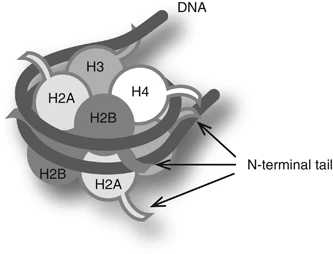

INCOMPLETE
{: .label .label-red }

{: .important-title }
> Aim
>
> Perform a Chipseq analysis

 

  

    <strong>Table of contents</strong>
  

  {: .text-delta }
- TOC
{:toc}

 

By combining chromatin immunoprecipitation (ChIP) assays with sequencing, ChIP sequencing (ChIP-Seq) is a powerful method for identifying genome-wide DNA binding sites for transcription factors and other proteins.

In this technique, we first cross-link chromatin complexes, isolate them from the cell nuclei and fragment them. We can then purify chromatin fragments containing our protein of interest by immunoprecipitation. After this, the DNA fragments are purified and sequenced. We can use the sequencing results to determine the DNA regions our protein of interest interacts with.

After isolation and fragmentation of chromatin, the protein–DNA complexes are captured using antibodies specific to the histone or transcription factor of interest. After reversal of crosslinks, the ChIP DNA is then purified and analyzed  by high-throughput sequencing (ChIP-seq).

Our epigenome is defined as methylated DNA and modified histone proteins (around which both methylated and unmethylated DNA are wrapped). DNA methylation and histone modifications undergo global changes during transitions in developmental states and in diseases such as cancer and therefore are major contributors to the dynamic nature of chromatin.

**Figure 1:** Schematic nucleosome structure. A nucleosome consists of two copies of each core histone (H2A, H2B, H3 and H4) and ∼150 bp DNA. The N-terminal tail of each histone is extruded from the nucleosome.

Specific histone modifications may still serve as good epigenetic indicators of chromatin state, even if they are not directly involved in the regulation of gene expression. Trimethylated H3K4 (H3K4me3) is a good marker associated with actively transcribed genes. In active genes, H3K4me3 is enriched around transcription start sites (TSS) ([Figure 2](#figure-2)), whereas H3K4me2 peaks just downstream, followed by monomethylated H3K4 (H3K4me1) further downstream towards the gene body. To summarize, TSSs of actively transcribed genes are marked by H3K4me3 and H3K27ac, and active enhancers can be identified by enrichments of both H3K4me1 and H3K27ac.

**Figure 2: **Distributions of six modifications with respect to genes are schematically illustrated. TSS, transcription start site; TES, transcription end site. H3K4me3 is enriched around TSSs. H3K4me1 is enriched around enhancers and more downstream. H3K27ac is enriched around active enhancers and TSSs. In undifferentiated stem cells, both H3K4me3 and H3K27me3 (active and inactive marks, respectively) are enriched around TSSs on many genes. H3K27me3 is enriched around inactive TSS in somatic cells. H3K9me3 is broadly distributed on inactive regions. H3K27me3 and H3K9me3 are usually not colocalized. TSSs are generally devoid of nucleosomes.

We need to add a control sample to our ChIP-seq experiment to account for non-specific binding of the antibody. Two commonly controls are used:

1. DNA isolated from the same cells but without immunoprecipitation (input DNA). Cells are cross-linked and fragmented, but no immunoprecipitation is performed. This DNA is then sequenced and used as a control to account for non-specific binding of the antibody [Control for subtracting the effect of chromatin accessibility]

2. Performing  a ChIP-seq experiment with an antibody that does not bind to the protein of interest (not known to be involved in DNA bindin or chromatin modifications, such as IgG). This is called an (Mock IP). [Control for antibody specificity] 