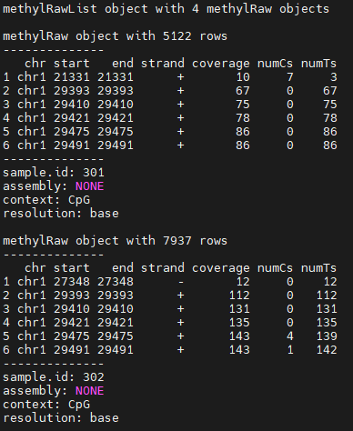
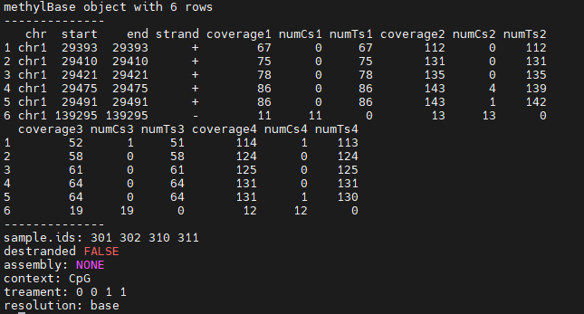
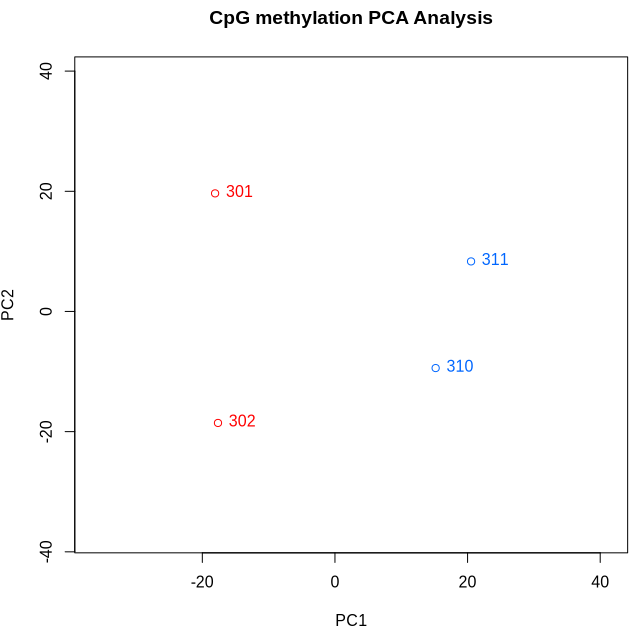
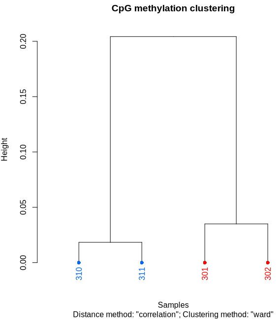
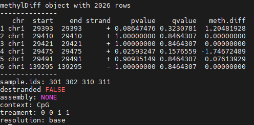

INCOMPLETE
{: .label .label-red }

{: .important-title }
> Aim
>
> Perform a Chipseq analysis

<br>
<details open markdown="block">
    <summary>
        <strong>Table of contents</strong>
    </summary>
    {: .text-delta }
- TOC
{:toc}
</details>
<br>


MethylKit is an R package for the analysis of DNA methylation data. It can be used to analyze data obtained by high-througput bisulfite sequencing (BS-seq) or reduced representation bisulfite sequencing (RRBS). 

[Learn more about methylKit](https://www.bioconductor.org/packages/release/bioc/vignettes/methylKit/inst/doc/methylKit.html)


The methylation call data has a slightly different format:

```
 chr  start    end strand coverage numCs numTs
chr1  18001  19000      *       48    47     1
chr1  29001  30000      *      625     2   623
chr1  61001  62000      *       38     0    38
chr1  91001  92000      *       44     0    44
chr1 139001 140000      *       12    12     0
chr1 144001 145000      *       47    45     2
```

Thus if we want to read the data generated by Bismark, we will need to modify the order of the columns.


We will use already formatted files for four different samples. 


### Activate the conda environment
{: .no_toc }

```bash
conda activate methylkit

# Move to the working directory if we want to save files 
cd /data2/student_space/st24_16_folder/epigenomics

# Open R
R
```


```r
# Create a list object with the path to the file of interest
file.list = list("/data2/biotecnologie_molecolari_magris/epigenomics/methylkit/dataset/301.rrbs.methylkit","/data2/biotecnologie_molecolari_magris/epigenomics/methylkit/dataset/302.rrbs.methylkit","/data2/biotecnologie_molecolari_magris/epigenomics/methylkit/dataset/310.rrbs.methylkit","/data2/biotecnologie_molecolari_magris/epigenomics/methylkit/dataset/311.rrbs.methylkit")
```


Load the files into methylKit objects. By defining the treatment function, we classify the samples in case or treament (1) vs controls (0). Samples 301 and 302 are controls, while samples 310 and 311 are treated.
```r
myMethylRawList = methRead(file.list, sample.id = list("301", "302", "310", "311"), assembly="NONE", treatment = c(0,0,1,1))
```

{: .success-title }
> STDOUT
>
>Received list of locations.
>Reading file.
>Reading file.
>Reading file.
>Reading file.




If we want to access to a single element of the list, we can use the following command: `myMethylRawList[[1]]` to access the first element of the list, which is the methylKit object for sample 301. Eitherwise, data can be accessed using `getData()` function, and we have a finer control on the data we want to access. 

Filter dataset by coverage 

```r
filtered.myMethylRawList = filterByCoverage(myMethylRawList, lo.count=4, lo.perc=NULL, hi.count=NULL, hi.perc=99.9)
```


<!--
n questo caso il valore minimo lo imponiamo come valore assoluto (lo.count) e lo settiamo pari a 4 (solitamente si usa 10, ma nel contesto CG possiamo scendere a 4), mentre il valore massimo lo imponiamo come percentile (hi.perc) mantenendo quindi fino al 99.9° percentile (vengono scartate le citosine con coverage più alto corrispondenti allo 0.1% delle citosine totali).
-->

Merge the datasets together

```r
meth = unite(filtered.myMethylRawList, destrand=FALSE, save.db=F)
```

<!--
Con destrand=FALSE indica che non voglio una media delle citosine corrispondenti alla stessa coppia CG (voglio che le due citosine sui 2 filamenti vengano considerate in modo indipendente); imposto anche che non voglio che vengano salvati i dati (save database).
-->

{: .success-title }
> STDOUT
>
> uniting...

The methylBase object should look like
```r
head(meth)
```



<!--
noto che effettivamente quello che abbiamo fatto è stato unire le citosine che presentavano un valore in tutti e 4 i campioni (questa operazione è già stata fatta in un altro contesto, in particolare nella preparazione del tabellone per l’analisi PCA e k-means). Se richiamiamo meth, vediamo il numero di righe totali (citosine):
il numero di citosine non è molto elevato.
-->

If now we would like to get the methylation percentage for each C in common between the four samples

```r
meth_round_percent = round(percMethylation(meth, rowids=T), 2)
```


If we want to have the methylation values per wiondow size (e.g. 1000), separately for each input sample

```r
tiles = tileMethylCounts(filtered.myMethylRawList, win.size = 1000, step.size=1000)
```

Now we can merge the information of the tiles

```r
tiles_united = unite(tiles, destrand=FALSE, save.db=F)
```

And tiles can be filtered 

```r
filtered.tiles = filterByCoverage(tiles, lo.count=4, lo.perc=NULL, hi.count=NULL, hi.perc=99.9)
```


In order to compute the differential methylation 


We can create a PCA 

```r
PCASamples(meth, adj.lim=c(1,1))
```


Or a hierarchical clustering 

```r
clusterSamples(meth, dist="correlation", method="ward", plot=TRUE)
```



And now we are ready to calculate the differential methylation between the two conditions. 

```r
myDiff=calculateDiffMeth(meth)
```
{: .success-title }
> STDOUT
>
> two groups detected:
> will calculate methylation difference as the difference of
>treatment (group: 1) - control (group: 0)

The created object will have a C in each row, with values of differential methylation. The last column represent the weighted difference of methylation between the test samples and control samples. Positive values will show hypermethylation of the test samples, while negative values will show hypomethylation. 

```r
myDiff
```


In order to get only the significant results

```r
myDiffSignificants=getMethylDiff(myDiff,difference=0,qvalue=0.01)
```

```r
myDiffSignificants
```


For example, C at position 449970, which correspond to row number 22 of our merged dataset, has a differentially methylated value of 44.82292

If we extract the corresponding values from the input table

```r
meth[meth@row.names==22,]
```

We will see that our control samples have low methylation values compared to the treated one, which have methylation values nearly to 1. 

Table can then be saved using the `write.table` function 

```r
write.table(getData(myDiffSignificants),file= "differential_methylation.tbl", quote=FALSE, sep="\t", row.names=FALSE)
```


The same can be obtained also for the tiles 

myDiff_tiles=calculateDiffMeth(tiles_united, adjust=c("qvalue"),test=c("Chisq"))

By performing the analysis this way we will get the putative windows were differential methylation is observed, which are referred as Differentially Methylated Regions (DMRs). 


The windows could be saved to file and imported in igv to visualise the differentially methylated windows in the genomic context, as for example genes and repetitive elements 